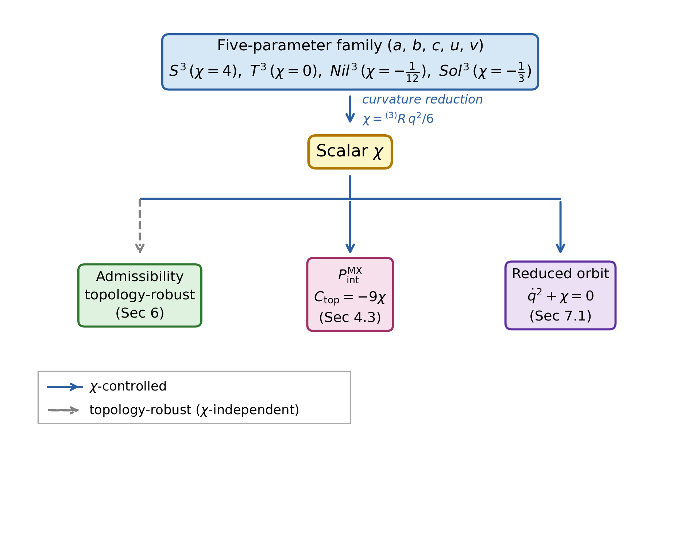

# DPPUv7-paper06: Reduced-Sector $\chi$ -Universality in Lorentzian EC+NY Minisuperspace

*Topology-Robust Admissibility, P-Channel Diagnostics, and Reduced Vacuum Orbits*

---

## Abstract

本稿では、Lorentzian DPPU の Einstein-Cartan + Nieh-Yan（EC+NY）reduced sector における topology dependence を、 $S^3$, $T^3$, $Nil^3$, $Sol^3$ の四つの homogeneous three-geometry にわたって解析する。対象は $\alpha=0$ の EC+NY reduced branch であり、 $Nil^3$ と $Sol^3$ については isotropic-scale reduction の範囲に限定する。

この reduced sector では、Hamiltonian constraint と torsion auxiliary equations は topology に対して頑健な admissibility pattern を示す。すなわち EH, AX, VT branches は admissible であり、MX branch は real auxiliary branch を通じて conditionally admissible である。Pontryagin 型の量については、form-Hodge density $P_{\rm form}$、internal-pair diagnostic $P_{\rm int}$、Nieh-Yan endpoint channel $Q_{\rm NY}$ を分離する。 $P_{\rm form}$ は active torsion branches において block orthogonality により厳密に消える。 $P_{\rm int}$ は MX branch の internal-pair diagnostic であり、その topology dependence は

$$
C_{\rm topology}=-9\chi
$$

に局在する。さらに、auxiliary shell 上の reduced vacuum orbit atlas は

$$
\dot q^2+\chi=0
$$

に帰着する。したがって $\chi>0$ では reduced vacuum atlas に実数初期データが存在せず、 $\chi=0$ では static / degenerate behavior、 $\chi<0$ では monotonic expansion と singular-approach collapse sheets が得られる。

$C_{\rm topology}=-9\chi$ と $\dot q^2+\chi=0$ はそれぞれ独立な計算経路から得られ、両者が同一 scalar $\chi$ に帰着することが $\chi$ -controlled topology universality の内容である。これらの結果は reduced Lorentzian EC+NY sector における分類結果であり、global/anisotropic/matter-coupled 拡張は将来課題として残す。

---

## 1. Introduction

### 1.1 Background and motivation

DPPU series では、Einstein-Cartan + Nieh-Yan 型 [7,8] の homogeneous geometry・torsion modes・Pontryagin-type diagnostics・topology response が段階的に整理されてきた [1–5]。paper05 [6] では、 $\alpha=0$ EC+NY baseline を Lorentzian signature の $S^3$ closed-FLRW branch に構成し、Hamiltonian constraint・torsion auxiliary sector・ $P_{\rm form}$ / $P_{\rm int}$ / $Q_{\rm NY}$ の channel separation を確立した。

本稿の目的は、この baseline を四つの topology

$$
S^3,\quad T^3,\quad Nil^3,\quad Sol^3
$$

に拡張し、topology dependence が branch classification と diagnostic structure にどのように現れるかを明確にすることである。本稿の主題は bounce cosmology の model building ではなく、reduced sector における $\chi$ -controlled topology universality の分類的解析である。

### 1.2 Main results

本稿の主結果を以下に列挙する。

1. Lorentzian EC+NY reduced setting では、 $S^3/T^3/Nil^3/Sol^3$ は同一の local admissibility pattern を共有する。EH/AX/VT は admissible、MX は conditionally admissible である。

2. active torsion branches において、 $P_{\rm form}$ は block orthogonality により厳密に消える。

3. $P_{\rm int}^{\rm MX}$ は topology-universal な functional template を持ち、topology 依存は $C_{\rm topology}=-9\chi$ に局在する。

4. $Q_{\rm NY}$ は endpoint / boundary channel であり、VT では zero、AX では on-shell trivial、MX では boundary-conditional である。

5. auxiliary shell 上の reduced vacuum orbit は $\dot q^2+\chi=0$ によって制御される。

6. 上記の vacuum reduced atlas では、bounce-like または recollapse-like な軌道クラスは見つからない。

結果 3 と 5 の $\chi$ はそれぞれ独立な経路（ $P_{\rm int}^{\rm MX}$ の symbolic 解析と EH/spatial-curvature sector からの導出）から得られており、両者の一致が $\chi$ -universality の実質を構成する。

つまり Lorentzian EC+NY reduced sector では topology は代数的 admissibility pattern を変えないが、MX internal diagnostic と vacuum auxiliary-shell orbit を同じ scalar $\chi$ を通じて制御する。

---

**Fig. 1** Three-level architecture of $\chi$-controlled topology universality in the reduced LZ-native isotropic EC+NY sector. 上段の five-parameter family $(a,b,c,u,v)$ から curvature reduction によって scalar $\chi$ が導出され、そこから三つの独立な帰結（Admissibility の topology-robust pattern、MX diagnostic $C_{\rm top}=-9\chi$、reduced vacuum orbit $\dot{q}^2+\chi=0$）が生じる。Admissibility への矢印（破線）は topology によって変化しない（ $\chi$ 非依存）ことを示す。 $P_{\rm int}^{\rm MX}$ と reduced orbit への矢印（実線）は $\chi$ を通じた制御を示す。*Scope*: reduced LZ-native isotropic EC+NY sector に限定する。Global / anisotropic / matter-coupled 拡張は本稿の範囲外。

---

### 1.3 Relation to earlier DPPU papers

paper05 [6] は $S^3$ における Lorentzian $\alpha=0$ EC+NY baseline を構成し、 $P_{\rm form}$ と $P_{\rm int}$ を分離した。本稿はその baseline を四 topology table に拡張する。

特に、本稿の $S^3$ 行は paper05 の $\alpha=0$ Lorentzian baseline を再現する。Table B1 の $S^3$ entry では $F_{\rm shell}=4$ であり、MX auxiliary Hessian は $-4q^2(\kappa^4\theta_{\rm NY}^2+1)/9$、classification は `L_CONDITIONALLY_ADMISSIBLE` となる。本稿の新規部分は、この同じ pattern が $T^3/Nil^3/Sol^3$ にも拡張される点である。

paper04 [5] では、同じ四つの Thurston geometry [9,10] が Euclidean response dictionary において none/uniaxial/triaxial/biaxial の四類型を与えた。本稿の Section 5.3 で述べるように、同じ四つの geometry が LZ-native isotropic five-parameter family の構造的に区別される loci として再出現する。この対応は structural resonance であり、Section 8.2 でその解釈を論じる。

### 1.4 Paper organization

- [Section 2](DPPUv7-paper06_sec02.md) は Lorentzian-native setup と topology conventions を固定する。
- [Section 3](DPPUv7-paper06_sec03.md) は Hamiltonian admissibility backbone を述べる。
- [Section 4](DPPUv7-paper06_sec04.md) は $P_{\rm form}$, $P_{\rm int}$, $Q_{\rm NY}$ の channel dictionary を整理する。
- [Section 5](DPPUv7-paper06_sec05.md) は diagnostic level と reduced-orbit level の χ-universality を接続する。
- [Section 6](DPPUv7-paper06_sec06.md) は four-topology admissibility classification をまとめる。
- [Section 7](DPPUv7-paper06_sec07.md) は reduced orbit atlas と χ-sign separation を述べる。
- [Section 8](DPPUv7-paper06_sec08.md) は χ-universality の意味・paper04 との関係・将来課題を議論する。
- [Appendix A](DPPUv7-paper06_appA.md) は topology conventions, local reductions, and caveats を補足する。
- [Appendix B](DPPUv7-paper06_appB.md) は tables, computational checks, and reproducibility notes をまとめる。
- [Appendix C](DPPUv7-paper06_appC.md) は Bianchi I lite comparison と reduced-atlas scope guard を述べる。

---

## References

1. Muacca, "Topology-Dependent Phase Classification of Effective Potentials in Einstein-Cartan + Nieh-Yan Minisuperspace," Zenodo, 10.5281/zenodo.18213677 (2026).
2. Muacca, "Structural Robustness of Isotropic $S^3$ Vacua in Einstein-Cartan Minisuperspace via Chiral Equilibrium and Weyl Stability," Zenodo, 10.5281/zenodo.18815498 (2026).
3. Muacca, "Unified Geometric Landau EFT of Homogeneous $S^3\times S^1$ Minisuperspace in Einstein-Cartan + Nieh-Yan Theory," Zenodo, 10.5281/zenodo.19144481 (2026).
4. Muacca, "Homogeneous Three-Topology Comparison and Mode Dictionary in Einstein-Cartan + Nieh-Yan Theory: Geometric Structure of EC-Weyl Coupling," Zenodo, 10.5281/zenodo.19425147 (2026).
5. Muacca, "Euclidean Geometric Response Dictionary and Selection Rules for Four Thurston Geometries," Zenodo, 10.5281/zenodo.19775695 (2026).
6. Muacca, "Lorentzian Einstein-Cartan Minisuperspace with Nieh-Yan Torsion: Hamiltonian Branches, Pontryagin Diagnostics, and Weyl-Source Obstructions," Zenodo, 10.5281/zenodo.20084722 (2026).
7. F. W. Hehl, P. von der Heyde, G. D. Kerlick, and J. M. Nester, "General relativity with spin and torsion: Foundations and prospects," Rev. Mod. Phys. **48**, 393–416 (1976), doi:10.1103/RevModPhys.48.393.
8. H. T. Nieh and M. L. Yan, "An identity in Riemann-Cartan geometry," J. Math. Phys. **23**, 373–374 (1982), doi:10.1063/1.525379.
9. W. P. Thurston, *Three-Dimensional Geometry and Topology, Volume 1*, edited by S. Levy (Princeton University Press, Princeton, NJ, 1997).
10. P. Scott, "The geometries of 3-manifolds," Bull. London Math. Soc. **15**, 401–487 (1983), doi:10.1112/blms/15.5.401.
11. G. F. R. Ellis and M. A. H. MacCallum, "A class of homogeneous cosmological models," Commun. Math. Phys. **12**, 108–141 (1969), doi:10.1007/BF01645908.
12. R. Brandenberger and P. Peter, "Bouncing Cosmologies: Progress and Problems," Found. Phys. **47**, 797–850 (2017), arXiv:1603.05834, doi:10.1007/s10701-016-0057-0.
13. O. Chandía and J. Zanelli, "Topological invariants, instantons, and the chiral anomaly on spaces with torsion," Phys. Rev. D **55**, 7580–7585 (1997), arXiv:hep-th/9702025, doi:10.1103/PhysRevD.55.7580.
