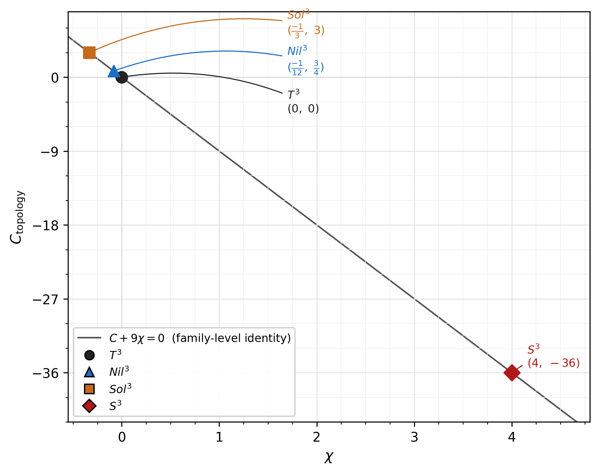
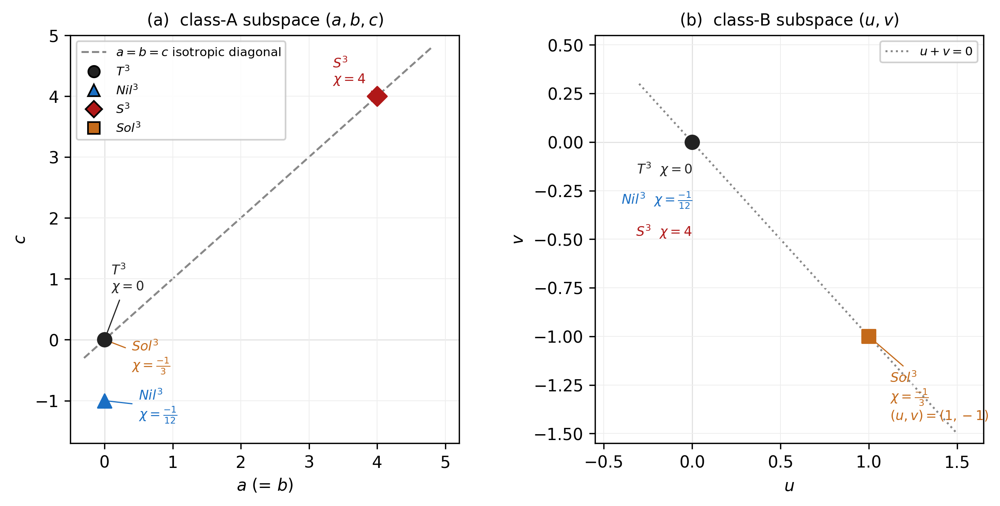

## 5. $\chi$ -universality across diagnostic and reduced-orbit levels

### 5.1 Two independent appearances of $\chi$

本稿の中心的主張は、二つの独立した計算が同一の scalar $\chi$ に収束するという bridge result である。

**Table 5a.** $\chi$ -universality summary.

| level | equation | 導出経路 |
|-------|----------|---------|
| diagnostic | $C_{\rm topology}=-9\chi$ | raw $P_{\rm int}^{\rm MX}$ からの template extraction |
| reduced orbit | $\dot q^2+\chi=0$ | auxiliary-shell vacuum orbit atlas |

---

**Fig. 2** Diagnostic bridge: $C_{\rm topology} = -9\chi$ line. 横軸 $\chi$（LC spatial curvature から独立に導出）、縦軸 $C_{\rm topology}$（raw $P_{\rm int}^{\rm MX}$ の symbolic 表式から $\chi$ を参照せず template fitting で抽出した係数）。四点（ $T^3, Nil^3, Sol^3, S^3$ ）はいずれも直線 $C + 9\chi = 0$ 上に完全に乗る。直線は Section 5.2 の family-level identity の図示であり、四点はその specialization である。*Scope*: LZ-native isotropic MX sector 内の family-level identity。 $P_{\rm int}^{\rm MX}$ は internal-pair diagnostic であり、true Pontryagin density ではない。

---

二つの量の独立性を強調しておく。 $C_{\rm topology}$ は Section 4.3 で述べたように、raw $P_{\rm int}^{\rm MX}$ の symbolic 表式から $\chi$ を参照せずに抽出した係数である。一方 $\chi$ は

$$
\chi=\frac{{}^{(3)}R\,q^2}{6}
$$

として spatial curvature sector から独立に導出される。それぞれの計算は相手の量を入力として用いないため、 $C_{\rm topology}=-9\chi$ は定義の言い換えではなく、二つの独立な計算経路の bridge result である。

### 5.2 Five-parameter family-level identity

Section 2.2 の five-parameter LZ-native isotropic family 全体において、 $C_{\rm topology}$ の family-level 表現は

$$
C = \frac{3}{4}\,\Delta = \frac{3}{4}\!\left(a^2-2ab-2ac+b^2-2bc+c^2+4u^2+4uv+4v^2\right)
$$

であり、 $\chi = -\Delta/12$ であるから

$$
C + 9\chi = \frac{3\Delta}{4} - \frac{9\Delta}{12} = 0
$$

が exact symbolic identity として成立する。この identity は四つの topology の specific な数値だけでなく、five-parameter family 全体にわたる構造的な恒等式であり、Appendix B でその代数的核心を示す。

### 5.3 Distinguished topology loci

四つの topology は、この five-parameter family の任意の sample point ではなく、構造的に区別される loci に位置する（Table 5b）。

**Table 5b.** Distinguished topology loci and paper04 echo.

| topology | $(a,b,c,u,v)$ | $\chi$ | $C=-9\chi$ | structural locus | paper04 echo |
|----------|--------------|-------:|-------------:|-----------------|--------------|
| $T^3$ | $(0,0,0,0,0)$ | $0$ | $0$ | origin | none |
| $Nil^3$ | $(0,0,-1,0,0)$ | $-1/12$ | $3/4$ | single class-A axis | uniaxial |
| $S^3$ | $(4,4,4,0,0)$ | $4$ | $-36$ | isotropic class-A diagonal | triaxial |
| $Sol^3$ | $(0,0,0,1,-1)$ | $-1/3$ | $3$ | balanced class-B diagonal pair | biaxial |

"paper04 echo" 欄は paper04 の KK Higgsing response dictionary（none/uniaxial/triaxial/biaxial）との interpretive 対応を示す（詳細は Section 8.2 参照）。

---

**Fig. 3** Distinguished loci in the five-parameter family $(a,b,c,u,v)$. **(a) class-A subspace $(a,b,c)$**: 全 topology は $b=a$ を満たす平面内にあり、 $(a,c)$ 座標で示す。 $T^3$ / $Sol^3$ は class-A 原点、 $Nil^3$ は単一軸上、 $S^3$ は等方対角線（ $a=b=c$ 、破線）上に位置する。**(b) class-B subspace $(u,v)$**: $T^3$ / $Nil^3$ / $S^3$ は $u=v=0$ 原点に集中し、 $Sol^3$ は balanced pair $(u,v)=(1,-1)$（点線: $u+v=0$）上に位置する。これら四点は five-parameter family の任意サンプルではなく、構造的に区別される loci である。*Caveat*: "paper04 echo" 欄は paper04 KK Higgsing dictionary との structural resonance を示す interpretive 対応であり、同一 mechanism または theorem ではない（Section 8.2 参照）。本 family は LZ-native isotropic MX sector に固有のものであり、full-theory universal family ではない。

---

χ-universality の範囲は、本稿の LZ-native isotropic MX reduced sector に限定される。full-theory universality、arbitrary anisotropic EOM、matter-coupled sector への拡張はここでは主張しない。
