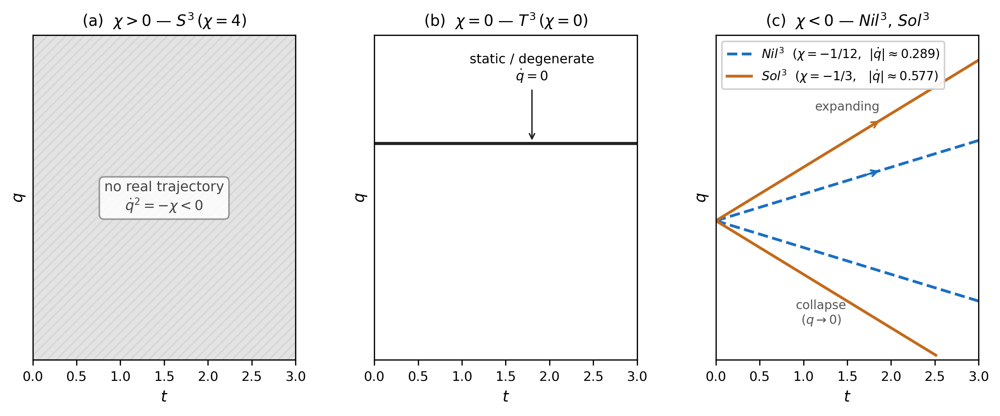

## 7. Reduced orbit atlas and $\chi$ -sign separation

### 7.1 Derivation of the auxiliary-shell orbit equation

Section 2.3 の reduced action から lapse variation を取ると Hamiltonian constraint は

$$
\dot q^2 + F_\Sigma(q,\eta,V;\chi) = 0\qquad\text{（ $N=1$ gauge）}
$$

となる（符号は Section 3.2 と一致）。各 torsion branch の auxiliary field は $\delta S/\delta\eta=\delta S/\delta V=0$ から代数的に決まる。本稿で用いる branch functions は

$$
F_{\rm EH}=\chi,\qquad
F_{\rm AX}=\chi-\eta^2,\qquad
F_{\rm VT}=\chi+\frac{q^2V^2}{9},
$$

$$
F_{\rm MX}=
\chi-\eta^2+\frac{q^2V^2}{9}
+\frac{2}{3}qV\eta\,\kappa^2\theta_{\rm NY}
$$

である。AX/VT/MX の auxiliary equations はそれぞれ $\eta=0$, $V=0$, $(\eta,V)=(0,0)$ を与える。MX では Section 3.2 の real branch 条件を保持する。したがって全 mode・全 topology を通じて

$$
F_\Sigma\big|_{\rm aux\text{-}shell} = \chi
$$

が成立し、

$$
\boxed{\dot q^2 + \chi = 0}
$$

を得る。この結果は Section 4.3 の diagnostic level の bridge result $C_{\rm topology}=-9\chi$ とは独立に得られており、χ-universality の dynamical 側の証拠を構成する（Section 5.1）。

### 7.2 χ-sign separation

auxiliary-shell orbit equation を $\chi$ の符号で分類すると Table 7 を得る。

**Table 7.** χ-sign reduced orbit atlas.

| $\chi$ の符号 | 代表 topology | reduced vacuum behavior | 補足 |
|-------------|-------------|------------------------|------|
| $\chi>0$ | $S^3$ | $\dot q^2=-\chi<0$：実数初期データが存在しない | Hamiltonian admissibility（Table 6）とは独立な vacuum orbit の特徴 |
| $\chi=0$ | $T^3$ | $\dot q^2=0$：static / degenerate | 安定性の議論は本稿の範囲外 |
| $\chi<0$ | $Nil^3/Sol^3$ | $\dot q^2=-\chi>0$：monotonic expansion と $q\to0$ singular-approach collapse | 本稿の vacuum reduced atlas における軌道分類 |

---

**Fig. 4** $\chi$-sign reduced orbit atlas schematic（定性的 $q$ – $t$ 図）。**(a) $\chi>0$（ $S^3$, $\chi=4$）**: $\dot{q}^2 = -\chi < 0$ のため実数初期データが存在しない（ハッチ領域）。**(b) $\chi=0$（ $T^3$, $\chi=0$）**: $\dot{q}=0$ → static / degenerate。**(c) $\chi<0$（ $Nil^3$, $Sol^3$）**: $\dot{q} = \pm\sqrt{-\chi}$ の二シート（expanding / collapsing）。 $Nil^3$（ $|\dot{q}|=\sqrt{1/12}\approx0.289$、破線）と $Sol^3$（ $|\dot{q}|=\sqrt{1/3}\approx0.577$、実線）の傾きの大きさが $|\chi|$ で決まることを示す。Bounce-like / recollapse-like クラスはいずれのパネルにも現れない。*Caveats*: 本図は $\dot{q}^2+\chi=0$ の constant-velocity 解の定性的模式図であり、effective potential を含まない。Scope guard: matter coupling / anisotropic / effective-source 拡張は軌道クラスを変え得る（Sec 7.4, App. C 参照）。

---

$\chi>0$（ $S^3$）の場合、real vacuum initial data が存在しないことは vacuum reduced atlas の特徴であり、Table 6 の admissibility 分類（EH/AX/VT/MX すべて admissible）とは独立である。matter coupling や effective source を導入すれば $S^3$ でも実数軌道が得られ得るが、それは本稿の範囲外の拡張である。

### 7.3 Full-branch sweep summary

全 16 branch（ $S^3/T^3/Nil^3/Sol^3$ $\times$ EH/AX/VT/MX）にわたる reduced vacuum orbit の分類は以下の通りである。 $\chi<0$ の各 branch は expanding sheet と collapsing sheet の二つを持つため、Table 8 は 16 branch そのものではなく、24 個の branch/sheet entries を数えている。

**Table 8.** Full-branch orbit class counts.

| orbit class | count |
|-------------|------:|
| `NO_REAL_AUX_SHELL_ORBIT` | 4 |
| `STATIC_OR_DEGENERATE` | 4 |
| `MONOTONIC_EXPANSION` | 8 |
| `SINGULAR_APPROACH` | 8 |
| `BOUNCE_LIKE` | 0 |
| `RECOLLAPSE_LIKE` | 0 |

`NO_REAL_AUX_SHELL_ORBIT` は $S^3$（ $\chi>0$）における実数初期データの不在を反映する。`SINGULAR_APPROACH` は $Nil^3/Sol^3$（ $\chi<0$）の collapse sheet が $q\to0$ に近づく軌道分類であり、有限時間 singularity や観測宇宙論の議論ではない。いずれのクラスも Table 6 の admissibility 分類とは別の問いに対応する。

### 7.4 Scope guard

本稿の reduced vacuum atlas には `BOUNCE_LIKE` および `RECOLLAPSE_LIKE` クラスは含まれない。これは vacuum isotropic reduced setting に関する記述であり、matter-coupled / anisotropic / effective-source モデルへ拡張するものではない。これらの setting へ到達するために必要な拡張は Section 8.3 で論じる。
